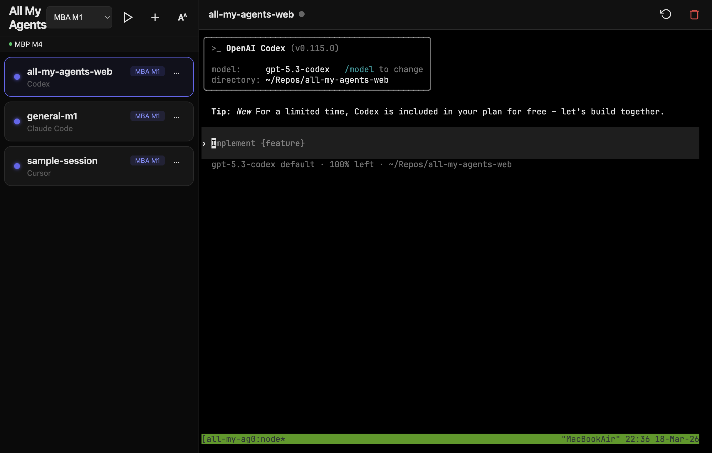

# All My Agents

A web interface for managing AI coding agent sessions (Claude Code, Cursor, Aider, Codex) across multiple machines. Works on both mobile and desktop, with auto-discovery of peers via Tailscale.

## UI Example



## Why

When running multiple AI coding agents in tmux across one or more machines, you need a way to monitor them and respond to input prompts from anywhere. All My Agents gives you a unified view of all sessions across your Tailscale mesh with full terminal access, status detection, and a speedrun mode for quickly triaging agents that need attention.

## Features

- **Multi-machine mesh** — auto-discovers other instances on your Tailscale network
- **Session list** with live status indicators (Working, Needs Input, Idle)
- **Full terminal access** via xterm.js + node-pty WebSocket connections
- **WebSocket proxy** — access terminal sessions on remote machines through the local server
- **Speedrun mode** — cycles through agents needing input, auto-advances after you respond
- **Client-side failover** — if the active server goes down, auto-switches to another
- **Session management** — create, kill, and restore tmux sessions (local and remote)
- **Agent detection** — identifies Claude Code, Cursor, Aider, Codex, or shell
- **Responsive layout** — sidebar + terminal on desktop, card list on mobile
- **Zoom controls** — adjustable text size, persisted across sessions
- **PWA-capable** — installable as a home screen app on iOS/Android
- **Mobile-optimized toolbar** — Paste, Esc, Tab, Ctrl keys, scroll mode (tmux copy-mode)
- **Swipe-to-go-back** navigation from left edge
- **Long-press to delete** sessions
- **Claude session enrichment** — reads `~/.claude/projects/` metadata to show project paths
- **Auto-refresh** — session list polls every 3s, terminal status polls every 2s

## Architecture

```
Phone / Laptop Browser
    │
    │  HTTP + WebSocket over Tailscale VPN
    │
    ▼
Node.js server (Machine A)  ◄──── auto-discovery ────►  Node.js server (Machine B)
    │                                                        │
    ├── /api/sessions (local tmux)                          ├── /api/sessions (local tmux)
    ├── /api/mesh/sessions (aggregated from all peers)      ├── /api/mesh/sessions
    ├── /api/identity (machine name + peer list)            ├── /api/identity
    ├── /ws/terminal/:target (local PTY)                    ├── /ws/terminal/:target
    └── /ws/proxy/:peer/:target (proxied to remote)         └── /ws/proxy/:peer/:target
```

## Requirements

- Node.js 22+
- tmux
- [Tailscale](https://tailscale.com/) (for remote access and peer auto-discovery)

## Setup

```bash
npm install
cp mesh.config.example.json mesh.config.json
```

Edit `mesh.config.json` with your machine name:
```json
{
  "name": "my-macbook",
  "peers": []
}
```

Peers are discovered automatically via Tailscale. You can also add manual peers:
```json
{
  "name": "my-macbook",
  "peers": [
    { "name": "desktop", "host": "100.x.x.x", "port": 3456 }
  ]
}
```

### Run

```bash
npm start          # production
npm run dev        # with --watch for auto-reload
```

### Run as a persistent service (launchd)

An example plist is provided in `setup/launchd-example.plist`. Customize the paths and label for your machine, then:

```bash
cp setup/launchd-example.plist ~/Library/LaunchAgents/com.allmyagents.plist
launchctl load ~/Library/LaunchAgents/com.allmyagents.plist
```

## Configuration

| Variable | Default | Description |
|----------|---------|-------------|
| `ALL_MY_AGENTS_PORT` | `3456` | Server port |
| `HIBERNATOR_CLI` | _(none)_ | Path to claude-hibernator `cli.py` (optional) |

## Access

From any device on your Tailscale network: `http://<tailscale-ip>:3456`

## Status Detection

The server captures the last 25 lines of each tmux pane and pattern-matches to determine agent state:

| Status | Detection |
|--------|-----------|
| **Working** | "esc to interrupt", token/timing counters |
| **Needs Input** | "esc to cancel", y/n prompts, Allow/Deny dialogs |
| **Idle** | Shell prompt visible (❯, $, #, %) |

## Speedrun Mode

Speedrun prioritizes sessions needing input across all machines. After you respond to an agent (press Enter), it detects the agent starting to work and shows a 3-second countdown before auto-advancing to the next session. Tap the overlay to skip the countdown.

## Security

- All proxy routes validate the target peer against the discovered/configured peer list
- Arbitrary host proxying is rejected (no open proxy)
- Peer session data is schema-validated (allowlisted fields only)
- tmux target parameters are validated against a strict regex
- WebSocket proxy buffers are capped to prevent memory exhaustion
- Network access is limited to your Tailscale network — do not expose to the public internet

## Known Issues

- **node-pty compatibility**: The stable node-pty 1.1.0 fails with `posix_spawnp` on Node 22 / macOS ARM. Must use beta 1.2.0-beta.11.
- **TMUX env stripping**: When the server itself runs inside tmux, the `TMUX` and `TMUX_PANE` env vars must be stripped before spawning `tmux attach`, or it will refuse to nest.
